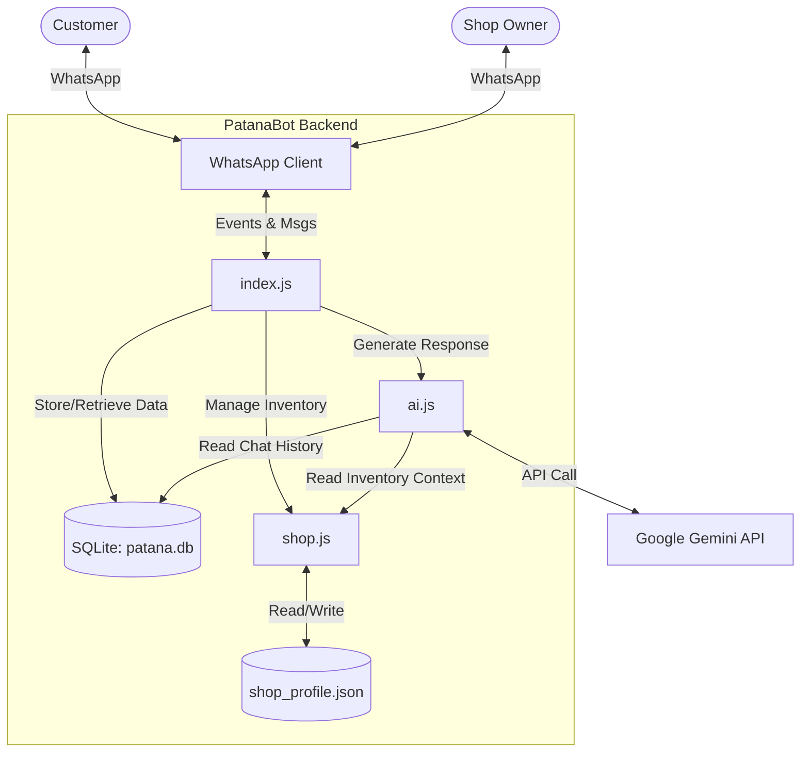

# PatanaBot - B2B AI Sales Negotiator

**PatanaBot** is an advanced AI sales negotiator for Tanzanian retail businesses, built with Node.js and Google's Gemini 2.0 Flash/Pro models. It integrates directly with WhatsApp to handle customer inquiries, negotiate prices within set limits, manage inventory, and close sales automatically—24/7.

The bot is designed to mimic a professional store manager, using "Corporate Swanglish" and adhering to strict sales protocols like "Mteja ni Mfalme" (Customer is King) and "Category Is King".

## Architecture

The system uses `whatsapp-web.js` to interface with WhatsApp. Incoming messages are processed by `index.js`, which routes them to the AI engine (`ai.js`) or handles owner commands directly. The AI uses a dual-model approach (Flash for speed/simple queries, Pro for complex negotiations) and accesses real-time inventory from `shop_profile.json` and persistent history/orders from `patana.db` (SQLite).



## Owner Commands

The shop owner (identified by `OWNER_PHONE` in `.env`) has full control via WhatsApp messages. All commands are case-insensitive.

| Command | Description | Example |
| :--- | :--- | :--- |
| **BIDHAA** / **STOO** | List current inventory with stock levels and prices. | `BIDHAA` |
| **UPDATE:** / **STOO:** | Update inventory using natural language (AI-powered). | `UPDATE: Samsung S24 bei mpya 1.3M mwisho 1.1M` |
| **MALIPO:** | Set payment instructions sent to customers. | `MALIPO: M-Pesa 0655... Jina: Duka Langu` |
| **TEMPLATE** / **FOMU** | Get an Excel template for bulk product import. | `TEMPLATE` |
| **ONGEZA:** | Bulk import products via text (comma-separated). | `ONGEZA: iPhone 11, 300000, 1, Used 64GB` |
| **[Image + Caption]** | Add/Update product with image. Caption format: `Name, BuyPrice, Stock, Condition`. | `iPhone 13, 900000, 5, Used` (with image) |
| **ZIMA:** | Pause the bot for a specific customer to take over manually. | `ZIMA: 255712345678` |
| **WASHA:** | Resume the bot for a customer (or `WOTE` for all). | `WASHA: 255712345678` |
| **RATE:** | Rate a customer (1-5 stars) to adjust AI tone/strategy. | `RATE: 255712345678 5` |
| **PROFILE:** | View a customer's rating, status, and escalation count. | `PROFILE: 255712345678` |
| **SERA:** | Set payment policy (`kwanza` = Pay First, `baadaye` = COD). | `SERA: kwanza` |
| **MSAADA** / **HELP** | Show the help menu with list of commands. | `MSAADA` |
| **THIBITISHA** | Confirm a pending payment (Reply to receipt alert). | `THIBITISHA` |
| **KATAA** | Reject a pending payment and restore stock. | `KATAA` |
| **NDIYO** | Confirm item availability for a stock check (Reply to alert). | `NDIYO` |
| **HAPANA** | Confirm item is out of stock (Reply to alert). | `HAPANA` |

## Setup Guide

### 1. Prerequisites
- **Node.js** (v18+) or **Docker**.
- A **Google Gemini API Key** (Get it from Google AI Studio).
- A **WhatsApp account** (Business or Personal) on a phone to scan the QR code.

### 2. Environment Variables
Create a `.env` file in the root directory:

```env
GEMINI_API_KEY=your_gemini_api_key_here
OWNER_PHONE=255XXXXXXXXX  # Your phone number (format: 255...)
FLASH_MODEL=gemini-2.0-flash
PRO_MODEL=gemini-2.0-flash # Or gemini-1.5-pro if available
SHOP_PROFILE_PATH=data/shop_profile.json
```

### 3. Docker Deployment (Recommended)
Build and run the container:

```bash
docker-compose up --build -d
```

View logs to scan the QR code:

```bash
docker-compose logs -f app
```

### 4. First-Time Pairing
1. Check the logs (`docker-compose logs -f app` or `npm start`).
2. A QR code will appear in the terminal.
3. Open WhatsApp on your phone -> Linked Devices -> Link a Device.
4. Scan the QR code.
5. You will see a "PatanaBot Enterprise is LIVE" message in the logs.

## Product Data Format

The inventory is stored in `data/shop_profile.json`. You can edit this file directly or use the `STOO:` / Excel commands.

```json
{
  "shop_name": "Kariakoo Tech Hub",
  "payment_info": "M-Pesa ...",
  "delivery_policy": "...",
  "payment_policy": "pay_first", // or "pay_on_delivery"
  "inventory": [
    {
      "id": "iphone_13_pro_max",       // Unique ID (auto-generated)
      "category": "SIMU",              // Used for categorization
      "brand": "Apple",                // Brand for tier matching
      "tier": "Premium",               // Premium, Mid-Range, Budget
      "item": "iPhone 13 Pro Max",     // Display Name
      "condition": "Used, 256GB",      // Condition details
      "public_price": 1200000,         // Starting asking price
      "secret_floor_price": 1100000,   // AI won't go below this
      "stock_qty": 2,                  // Available stock
      "features": "120Hz, 3x Zoom...", // Key selling points
      "images": ["iphone_13_1.jpg"]    // Images in data/images/
    }
  ]
}
```

## AI Behavior & Protocols

PatanaBot follows strict sales psychology rules defined in `src/ai.js`:

### 1. "Mteja ni Mfalme" (Customer is King)
- **Zero Disrespect:** Never mocks lowball offers.
- **Education:** Politely corrects unrealistic prices using inventory data.
- **Persistence:** Doesn't accept "No" immediately; asks for reasons or offers alternatives/small discounts (down to floor price).

### 2. Category Is King
- **Strict Hierarchy:**
  - If a customer wants a **Laptop**, the AI MUST sell a **Laptop**.
  - It will NEVER cross-sell unrelated items (e.g., offering a Charger when asked for a Laptop) as this is considered disrespectful.
- **Tier Matching:**
  - If a Premium item (e.g., iPhone 13) is too expensive, it down-sells to a Mid-Range item *within the same category* (e.g., iPhone 11), not a Budget item (e.g., Tecno).

### 3. Dual-Model Routing
- **Flash Model (Gemini 2.0 Flash):** Handles general inquiries, greetings, and simple questions for speed.
- **Pro Model (Gemini 2.0/1.5 Pro):** Activated for complex negotiations, price objections, stock checks, and when the user mentions budget constraints.

### 4. Smart Escalation
- **Stock Checks:** If an item isn't found but might exist (fuzzy match), the AI asks the owner via WhatsApp (`[CHECK_STOCK]`).
- **Alerts:** If a customer is difficult or a troll, the AI alerts the owner (`[ALERT]`).
- **Pending Payments:** When a sale is closed, the AI tags it (`[PENDING_PAYMENT]`) and waits for the owner to confirm the receipt (`THIBITISHA`).
